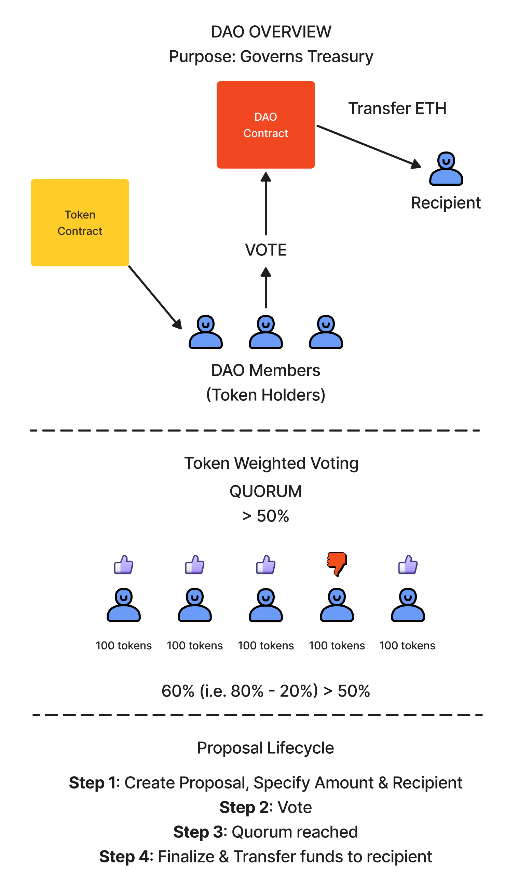

# Crypto Token (CT) DAO
This project demonstrates a basic DAO contract governed by an ERC-20 token. The DAO contract manages proposals that token holders can vote on to distribute tokens held by the DAO treasury to proposal recipients. The front-end allows users to interact with the DAO contract to submit new proposals, vote on proposals, and finalize proposals. Test files and scripts for deployment are included.

## Stack
Technologies Used:
* JavaScript
* React
* Solidity
* Bootstrap

Libraries Used:
* [React-Bootstrap](https://react-bootstrap.github.io/)

Testing Libraries:
* [React Testing Library](https://testing-library.com/docs/react-testing-library/intro/)
* [Jest](https://jestjs.io/)
* [Chai](https://www.chaijs.com/)

Dev Tools:
* [Hardhat](https://hardhat.org/)
* [dotenv](https://www.npmjs.com/package/dotenv)

## Local Testing
To test the Crowdsale locally, run the following:
```shell
npx hardhat node

npx hardhat --network localhost scripts/1_deploy.js

npx hardhat --network localhost scripts/2_seed.js

npm run start
```


